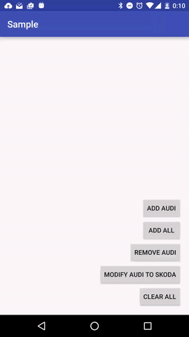

# ExtendedRecyclerAdapter
Simple library for DRY recycler adapter



ExtendedRecyclerAdapter provides you a very simple way for implement RecyclerView Adapter class in Android Projects. 
Creating adapters is very repetitive. With this library you can implement Adapter in a few minutes!!!

Please, learn about how recycler view adapter works before use this library! :)

## Features
- Items CRUD, simply, directly :)
- ItemClickListener and LongItemClickListener

## Import:

Not avaible NOW... waiting for jcenter team...

Add this to your build.gradle module:
```groovy
dependencies{
    compile 'com.sergiocasero:extendedrecycleradapter:1.0.0'
}
```

## Show me the code!!
Easy easy!!!, simply implement YourRecyclerAdapter like this... and you are done!! :)

```java

// Car is an item example model
public class MyRecyclerAdapter extends ExtendedRecyclerAdapter<Car> {

    //return viewHolder
    @Override
    protected ExtendedRecyclerViewHolder getViewHolder(View view) {
        return new MyViewHolder(view);
    }

    //Item layout id
    @Override
    protected int getItemLayoutId() {
        return R.layout.item_car;
    }

    //Your viewholder... you can use ButterKnife!
    public class MyViewHolder extends ExtendedRecyclerViewHolder {

        @Bind(R.id.car_id)
        TextView carId;

        @Bind(R.id.car_name)
        TextView carName;

        public MyViewHolder(View itemView) {
            super(itemView);
        }
        
        //Binding model with view attrs :)
        @Override
        public void bind(Car item) {
            carId.setText(String.valueOf(item.getId()));
            carName.setText(String.valueOf(item.getName()));
        }
    }
}
```


Now, you are ready to use listeners, CRUD methods... 

## Usage example:

```java
  // Recycler view
  @Bind(R.id.recycler)
  RecyclerView cars;

  
  // Initialize
  myRecyclerAdapter = new MyRecyclerAdapter();
  cars.setAdapter(myRecyclerAdapter);
  cars.setLayoutManager(new LinearLayoutManager(this, LinearLayoutManager.VERTICAL, false));

  // Adapter listeners
  myRecyclerAdapter.setOnItemClickListener(...);
  myRecyclerAdapter.setOnLongItemClickListener(...);
  myRecyclerAdapter.setOnNotFoundListener(...);
  
  // CRUD methods
  // Mock car model
  private Car audi;

  // Add
  myRecyclerAdapter.add(audi);
  myRecyclerAdapter.addAll(list);
  
  //Update
  audi.setName("skoda");
  myRecyclerAdapter.update(audi);
  
  //Remove
  myRecyclerAdapter.remove(audi);
  
  //Clear all
  myRecyclerAdapter.clear();
```

# Contributing to the project

Feel free to report any issues or suggest new features.

# License

Copyright 2016 Sergio Casero Hernández

Licensed under the Apache License, Version 2.0 (the "License");
you may not use this file except in compliance with the License.
You may obtain a copy of the License at

    http://www.apache.org/licenses/LICENSE-2.0

Unless required by applicable law or agreed to in writing, software
distributed under the License is distributed on an "AS IS" BASIS,
WITHOUT WARRANTIES OR CONDITIONS OF ANY KIND, either express or implied.
See the License for the specific language governing permissions and
limitations under the License.
